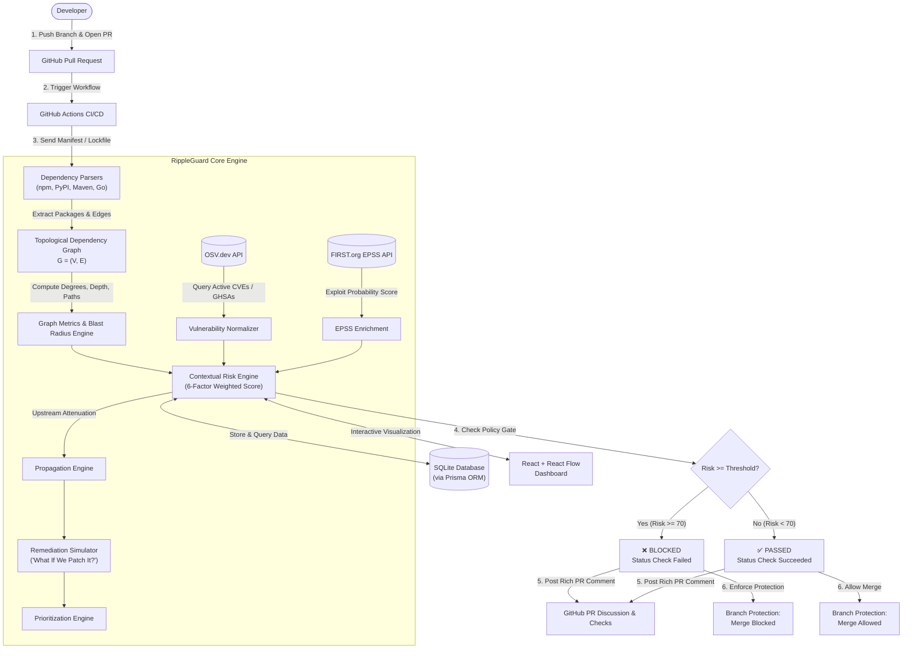

# 🛡️ RippleGuard — GitHub Pull Request Security Gate

> **Contextual Supply-Chain Risk Engine & Merge Gate for Pull Requests**  
> *Determine whether the dependency and security risk introduced by a Pull Request is acceptable before merging into the main branch.*

[](https://www.typescriptlang.org/)
[](https://nodejs.org/)
[](https://react.dev/)
[](https://reactflow.dev/)
[]()

---

## 📌 Problem Statement: Why Normal CVE Scanning is Insufficient

Traditional Software Composition Analysis (SCA) tools suffer from severe false-positive fatigue and lack context:

1. **Flat Scans vs. Topological Realities:** A standard scanner treats a deeply nested, rarely executed transitive dependency identically to a direct, outward-facing authentication library.
2. **Raw CVSS vs. Exploitability in the Wild:** CVSS scores reflect theoretical severity in isolation. They ignore whether the vulnerability has an actively weaponized exploit (EPSS probability) or whether downstream services consume the affected APIs.
3. **Ignoring Blast Radius & Upstream Attenuation:** If library $C$ is compromised, how many parent services depend on it? What is its reachability from the application root? Traditional scanners report isolated alerts without modeling upstream propagation.
4. **Binary Noise without Actionable Remediation:** Developers are flooded with hundreds of unprioritized CVE alerts without clear answers to: *"Which single upgrade yields the largest risk drop?"* or *"What if we patch library C today?"*

**RippleGuard fixes this** by turning security scanning into an **intelligent PR merge gate** that models dependencies as a Directed Acyclic Graph (DAG), enriches disclosures with EPSS exploit probabilities, computes topological blast radius, simulates remediation impact, and blocks or allows the PR based on an organizational risk policy.

---

## 🏛️ System Architecture



---

## 📐 Graph Semantics & Direction Convention

In RippleGuard, the dependency graph is modeled as:
$$G = (V, E)$$
where $V$ represents unique package nodes and $E$ represents dependency relationships.

### Direction Convention:
$$\mathbf{A \rightarrow B \quad \text{means} \quad \text{"A depends on B"}}$$

```
Application (Root)
 ├── A ────────┐
 │             ↓
 └── B ────→ C 🔴 (Vulnerable Dependency)
             ↓
             D
```

- **In-Degree of C:** Number of components directly consuming $C$ (in this example, $A$ and $B$, $\text{in-degree} = 2$).
- **Transitive Dependents of C:** All upstream consumers that reach $C$ through any directed path ($\{A, B, \text{Application}\}$).
- **Blast Radius:** Quantifies the potential systemic compromise if package $C$ is subverted. It combines consumer breadth, depth from the entry point, path multiplicity, and graph centrality.

---

## 🧮 Contextual Risk Engine Formula

RippleGuard uses a transparent, configurable 6-factor risk calculation normalized from **0 to 100**:

$$\text{Risk}(p) = \underbrace{w_{\text{sev}} \cdot S}_{\text{Severity}} + \underbrace{w_{\text{epss}} \cdot E}_{\text{Exploit Prob}} + \underbrace{w_{\text{blast}} \cdot B}_{\text{Blast Radius}} + \underbrace{w_{\text{depth}} \cdot D + w_{\text{cent}} \cdot C}_{\text{Topological Impact}} - \underbrace{F_{\text{fix}}}_{\text{Fix Discount}}$$

| Factor | Weight / Parameter | Description |
| :--- | :--- | :--- |
| **Severity ($S$)** | $35\%$ ($w_{\text{sev}} = 0.35$) | Maximum CVSS v3 base score across reported disclosures (0–100). |
| **Exploit Probability ($E$)** | $25\%$ ($w_{\text{epss}} = 0.25$) | FIRST.org EPSS score representing likelihood of exploitation in the wild. |
| **Blast Radius ($B$)** | $20\%$ ($w_{\text{blast}} = 0.20$) | Ratio of affected upstream nodes, consumer count, and path multiplicity. |
| **Depth Exposure ($D$)** | $10\%$ ($w_{\text{depth}} = 0.10$) | Direct dependencies (depth 1) pose immediate exposure; deeper hops attenuate. |
| **Graph Centrality ($C$)** | $10\%$ ($w_{\text{cent}} = 0.10$) | Betweenness and degree centrality in the project topology. |
| **Fix Availability ($F_{\text{fix}}$)** | $-5 \text{ pts}$ | Discount applied when an official, non-breaking upgrade is readily available. |

### Risk Level Categorization:
- `0 – 29` : 🟢 **LOW**
- `30 – 49` : 🔵 **MEDIUM**
- `50 – 69` : 🟡 **HIGH**
- `70 – 84` : 🟠 **VERY HIGH**
- `85 – 100`: 🔴 **CRITICAL**

### Upstream Risk Propagation (Attenuation):
When a leaf node $C$ has risk $R(C)$, its parents receive attenuated risk:
$$R_{\text{propagated}}(P) = R(C) \times \alpha$$
*(where $\alpha = 0.70$ is the configurable per-hop attenuation factor)*. Risk is strictly bounded to $\le 100$.

---

## 🛠️ "What If We Patch It?" Remediation Simulator

RippleGuard's key feature is predictive patch simulation:
1. For every vulnerable dependency with an available fix (e.g. `crypto-core-pkg-c` $2.1.0 \rightarrow 2.4.0$), RippleGuard temporarily patches the node in-memory.
2. The graph topology, reachability, and risk scores are recomputed.
3. The system calculates the **Estimated Risk Reduction**:
   $$\Delta \text{Risk} = \frac{\text{Risk}_{\text{current}} - \text{Risk}_{\text{simulated}}}{\text{Risk}_{\text{current}}} \times 100\%$$
4. **Example Output:**
   - **Current PR Risk:** `87.0` (CRITICAL — Merge Blocked)
   - **Simulated After Patch:** `43.0` (MEDIUM)
   - **Estimated Risk Reduction:** `44.0 points` (**-50.6%**)
   - **Predicted Outcome:** ✅ **PR becomes eligible to merge**

---

## 🤖 ML Architecture Roadmap (`RiskModel` Abstraction)

RippleGuard is architected with a decoupled `RiskModel` interface:
```typescript
export interface RiskModel {
  name: string;
  version: string;
  calculateRisk(packages: RiskInputPackage[], relationships: Array<{ source: string; target: string }>, threshold?: number): ProjectRiskResult;
}
```
- **Current MVP:** Uses `RuleBasedRiskModel` (deterministic, transparent, fully configurable).
- **Future Extension:** `MLRiskModel` (in `backend/src/risk/ml-schema.ts`) specifies a feature vector schema (CVSS, EPSS, dependency depth, in-degree, blast ratio, patch distance) ready for training Graph Neural Networks (GNNs) or gradient boosted trees (XGBoost/LightGBM) on historical CVE exploit incidents.

---

## 💻 Running Locally

### Prerequisites
- **Node.js** v20+
- **npm** v10+
- *(Zero Docker required — uses native Node.js and embedded SQLite)*

### 1. Clone & Install
```bash
# Clone the repository
git clone https://github.com/Suyash00-glitch/rippleguard-prototype.git
cd rippleguard-prototype

# Configure environment files
cp .env.example .env
cp .env.example backend/.env

# Install backend dependencies & initialize database
cd backend
npm install
npx prisma db push

# Install frontend dependencies
cd ../frontend
npm install
```

### 2. Run the Development Environment
Run backend and frontend concurrently:
```bash
# Terminal 1: Backend API (runs on http://localhost:4000)
cd backend
npm run dev

# Terminal 2: Frontend Dashboard (runs on http://localhost:3000)
cd frontend
npm run dev
```

Open your browser at **`http://localhost:3000`**.

### 3. Run Automated Tests
```bash
cd backend
npm test
```
Runs 10 comprehensive unit & integration tests covering parsers, DAG direction, blast radius, risk propagation, patch simulation, and PR gate decisions.

---

## 🚀 Canonical Demo Mode (1-Click Walkthrough)

1. Open the dashboard at `http://localhost:3000`.
2. Click **"Load Canonical Demo"** in the top navigation bar.
3. The dashboard executes the end-to-end pipeline on `examples/vulnerable-project/package-lock.json`:
   - Builds DAG: `App → A, B → C (2.1.0)` and `App → D → E`.
   - Discloses CVE-2024-8891 on package `crypto-core-pkg-c` (CVSS 9.8, EPSS 87%).
   - Calculates contextual risk: **87 / 100 (CRITICAL)**.
   - Blocks the PR Gate (`Status: BLOCKED`).
4. Click the **"Dependency Graph"** tab to interact with the React Flow DAG and inspect node $C$'s blast radius.
5. Click **"What If We Patch?"** to see the simulated upgrade to `2.4.0` dropping risk by **50.6%**.
6. Click **"PR Gate & Checks"** and click **"Simulate Developer Pushing Fix (v2.4.0)"**:
   - RippleGuard re-runs in real-time.
   - Risk drops to **43 / 100**.
   - Gate status switches from `BLOCKED` to `PASSED`.
   - The green **"Merge Pull Request"** button unlocks!

---

## 🛡️ GitHub Actions Integration

Use `.github/workflows/rippleguard.yml` in any repository:

```yaml
name: RippleGuard Security Gate

on:
  pull_request:
    types: [opened, synchronize, reopened]
    paths: ['**/package-lock.json', '**/requirements.txt']

jobs:
  security-gate:
    runs-on: ubuntu-latest
    steps:
      - uses: actions/checkout@v4
      - name: Run RippleGuard PR Gate Check
        uses: ./github-action
        with:
          rippleguard-url: 'https://api.rippleguard.internal'
          file-path: 'package-lock.json'
          threshold: '70'
          github-token: ${{ secrets.GITHUB_TOKEN }}
```

### GitHub PR Comment Output Example

```markdown
## 🛡️ RippleGuard Security Analysis

> ⚠️ **Pull Request Merge Gate Blocked**
> The introduced dependency changes exceed the allowed organizational risk threshold (`87/100` vs threshold `70`).

### 📊 Risk Summary
- **Status:** ❌ **BLOCKED**
- **Risk Score:** `87 / 100`
- **Risk Level:** **CRITICAL**
- **Total Vulnerabilities:** 1 (🚨 Critical: 1, ⚠️ High: 0, ⚡ Medium: 0)

### 🎯 Highest-Priority Vulnerability
- **Package:** `crypto-core-pkg-c` (installed: `2.1.0`)
- **Vulnerability:** `CVE-2024-8891` (CVSS: **9.8**)
- **Exploit Probability (EPSS):** **87.0%** (percentile: 96.0%)
- **Dependents Affected:** **2** direct / **3** transitive
- **Blast Radius Score:** `85/100`

### 🛠️ Recommended Remediation (Simulated)
- **Action:** Upgrade `crypto-core-pkg-c` from `2.1.0` → **`2.4.0`**
- **Estimated Risk Reduction:** `87` → `43` (**-50.6%**)
- **Expected Outcome:** ✅ **PR becomes eligible to merge**

---
### 🔒 Merge Decision
**Recommendation:** ❌ **DO NOT MERGE** until high-risk dependencies are upgraded or risk score falls below `70`.
```

---

## ⚙️ Environment Variables

| Variable | Default | Description |
| :--- | :--- | :--- |
| `PORT` | `4000` | Backend API server port. |
| `DATABASE_URL` | `file:./rippleguard.db` | SQLite or PostgreSQL connection string. |
| `OSV_API_URL` | `https://api.osv.dev/v1` | Open Source Vulnerabilities REST API. |
| `EPSS_API_URL` | `https://api.first.org/data/v1/epss` | FIRST.org EPSS probability endpoint. |
| `RIPPLEGUARD_RISK_THRESHOLD`| `70` | Cutoff risk score (0–100) above which PRs are blocked. |
| `ENABLE_OFFLINE_MOCK_FALLBACK`| `true` | Enables deterministic mock fallback when offline. |

---

## 🔬 Limitations & Future Work

- **Static Call-Graph Reachability:** Current graph reachability models package-level imports. Future iterations can incorporate function-level call-graph analysis (AST extraction) to determine if vulnerable symbols are invoked.
- **Transitive Lockfile Depth:** Full lockfiles (e.g. `package-lock.json` v3) resolve transitive dependencies completely. For flat manifests like `requirements.txt`, deeper resolution relies on external metadata APIs (deps.dev).
- **Trained GNN Risk Engine:** Transitioning the prototype's `RuleBasedRiskModel` into the provided `MLRiskModel` using real incident telemetry.

---

## 📜 License

Licensed under the [Apache License, Version 2.0](LICENSE).
